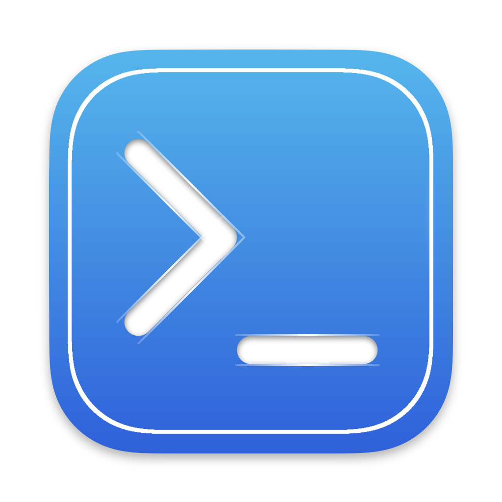

<div align="center">
   
   <h1>Unscripted Core</h1>
   <p>The core module for Unscripted, a visual novel about software development.</p>
</div>

[![Ren'Py 7.3.5][renpy]](https://renpy.org)
[](LICENSE.txt)

## What is Unscripted Core?

Unscripted Core contains the source code for most, if not all, of the logic for the game. This logic includes, but is not limited to:

- User interface controls and splash screens
- Credits sequencing
- Definitions for images and audio
- Minigame frontend logic (not covered by [Fira](https://github.com/UnscriptedVN/fira))
- Open-sourced assets such as images and audio
- Classes and logic for player data
- Logic for build configurations

### Why are some assets not included?

Assets that are not to essential to Unscripted Core, as defined in the game license, are not held under the same license and must be treated differently:

> 7. Only the source code files and assets associated with the Unscripted Core shall be distributed
>   on a given repository or project as outlined in the Mozilla Public License and Subsection 1.
>
>      a. Likewise, the Unscripted Story, image assets and background music must not be bundled
>      with the Unscripted Core as outlines in Subsections 3, 4, and 5, unless given explicit,
>      written permission from The Team.
>
>     i. If permission has been granted to bundle the aforementioned assets, the written
>         notice must be attached to the project and clearly labeled.

## Getting started

To get started, clone this repository into a Ren'Py project or Unscripted mod in the `core` folder. The files will automatically be compiled with Unscripted.

### Installing dependencies

Unscripted Core (and the game, subsequently) rely on some Python packages to operate properly. The required dependencies are listed in requirements.txt.

To install these dependencies, run the following\*:

```
pip install -r path/to/core/requirements.txt --target game/python-packages
```

> \*Note: Unscripted is currently built with Ren'Py 7.3.5, which requires that these packages be Python 2-compatible. Run the pip command in a Python 2 environment, either from your system or the provided Python environment in Ren'Py.

## License

Unscripted Core is licensed under the Mozilla Public License, v2.0, as stated in Section II, Subsection 1 of the game license:

> 1. The source code to the Unscripted Core shall hereby be licensed under the Mozilla Public License 2.0 (MPL). The license should be provided with the game in MPL.txt.
   >
>       a. Likewise, mods that modify the existing game files must be held under the same license and the source code must be made available with distribution.
>
>       b. Mods must retain the copyright notice and license as provided in Unscripted.

<!--Images-->
[renpy]: https://img.shields.io/badge/renpy-7.3.5-orange.svg
[license]: https://img.shields.io/badge/license-MPLv2-green.svg?logo=mozilla