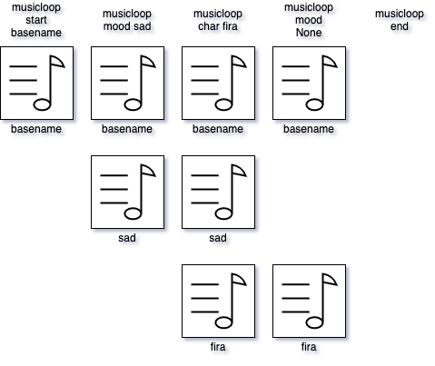

# Music Loops

The music loop system is an extension of the audio capabilities Ren'Py provides. Music loops are small music files, usually separated by instrument or musical composition, that can be looped. They work together to create a dynamic soundtrack in an adaptive/dynamic way, helping set the tone for a scene or give players something to latch on to in association with a character.

Music loops usually fall into three categories:

- **Bases**, where the track is meant as a background loop. This is typically use with instruments or loops such as percussion, bass, etc.
- **Moods**, where the track is meant to depict or invoke a particular mood or stage a scene type. These will usually contain sub-melodies or supporting tracks for a melody.
- **Characters**, where the track is meant to add a personal touch to a scene. These are extra melodies that work on top of moods and are usually used to denote special melodies for the different characters in the game.

Using the music loop system is similar to how Live Loops are handled in GarageBand. When a new track is added or removed in a particular category, the music will continue to play until the loop cycle ends before starting the next batch.

## Music Loop statements

### `musicloop start basename`

Start a music loop session with _basename_ as the base track.

**Arguments**

- `basename`: The path to an audio file or an audio definition to use as the base.

### `musicloop update channel track`

Enqueues _track_ into _channel_ and waits until the next loop iteration to play the track.

**Arguments**

- `channel`: The channel to update. Can be `base`, `mood`, or `char`.
- `track`: The path to an audio file or an audio definition to enqueue in that channel.

### `musicloop end`

Waits for the current loop iteration to play, then ends the music loop session.
